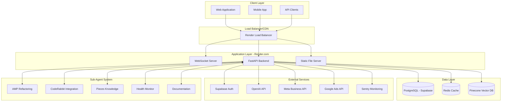
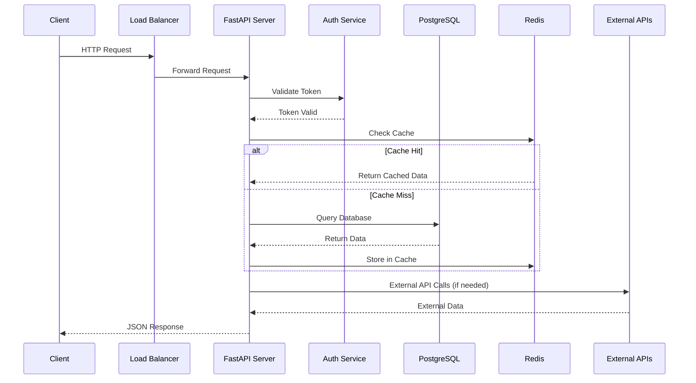
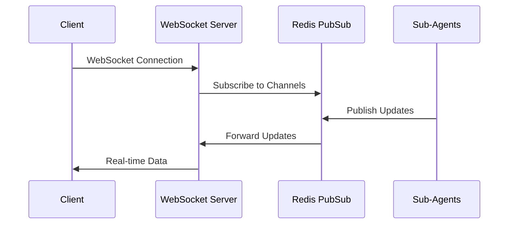
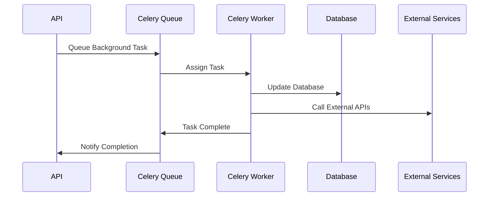
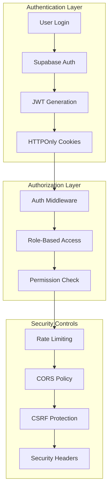
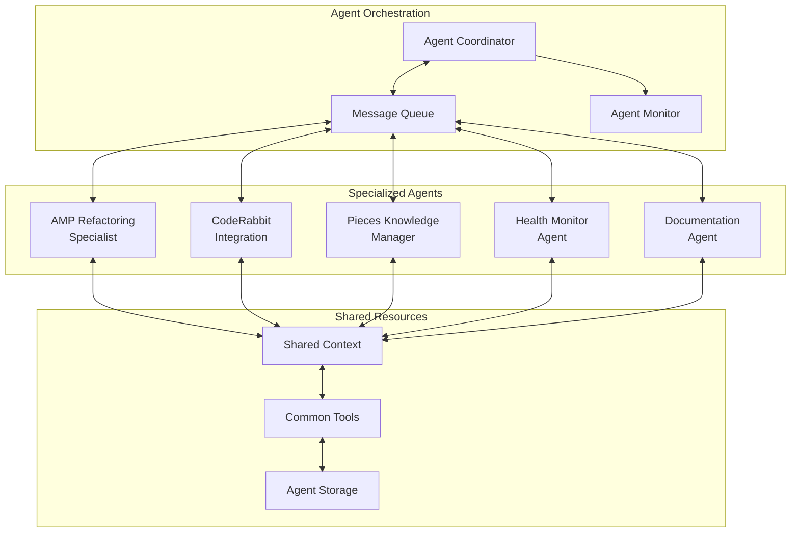
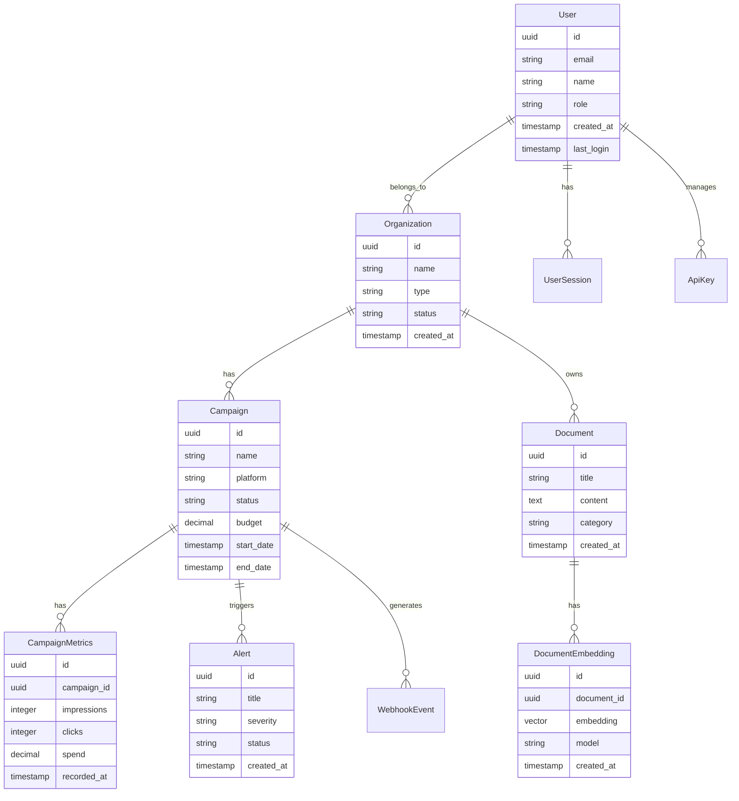
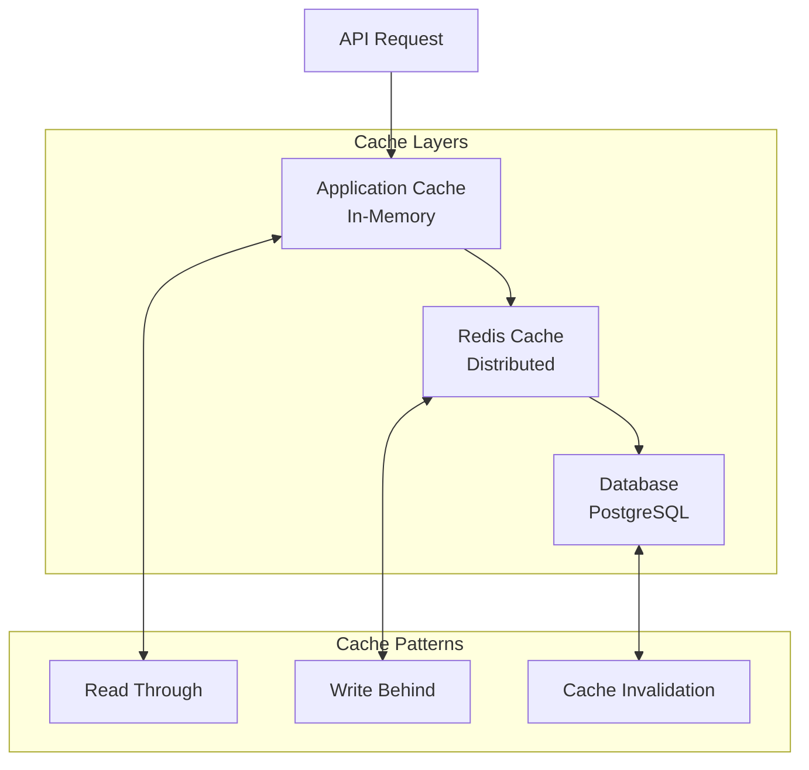
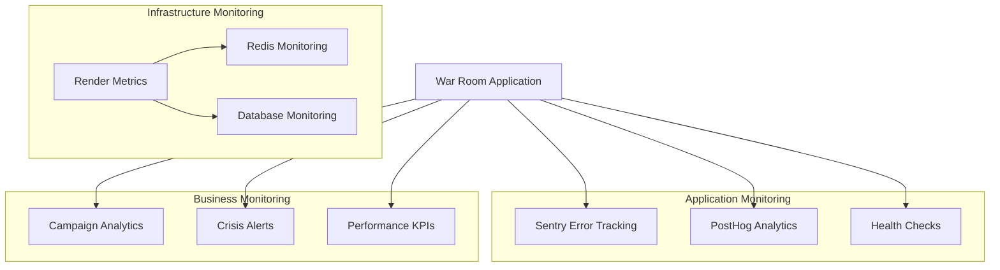
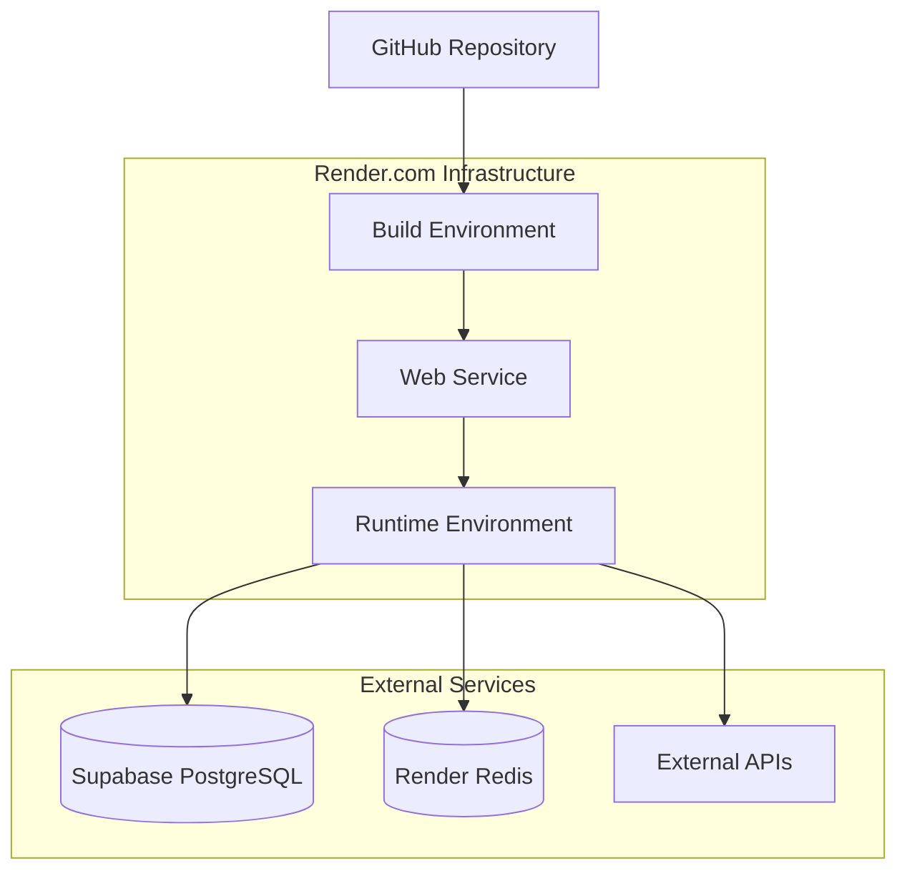

# War Room Architecture v1.0

## System Overview

War Room is a comprehensive campaign management platform built with modern web technologies, designed for scalability, real-time performance, and security. The architecture supports multi-tenant campaign operations with AI-powered intelligence, real-time monitoring, and automated sub-agent systems.

## High-Level Architecture



## Technology Stack

### Frontend Architecture
- **Framework**: React 18 with TypeScript for type safety and modern React features
- **Build Tool**: Vite for fast development builds and optimized production bundles
- **State Management**: Redux Toolkit with RTK Query for API state management
- **UI Framework**: Shadcn/ui components with Tailwind CSS for consistent design
- **Animation**: Framer Motion for smooth UI transitions and animations
- **Charts & Visualization**: Recharts for analytics dashboards and data visualization
- **Real-time Communication**: Native WebSocket API with reconnection handling
- **Testing**: Jest with React Testing Library for component testing
- **Code Quality**: ESLint, Prettier, and TypeScript strict mode

### Backend Architecture
- **Framework**: FastAPI (Python 3.11+) for high-performance async API development
- **Database**: PostgreSQL 15 with async SQLAlchemy ORM
- **Vector Database**: Pinecone for AI-powered document intelligence and semantic search
- **Cache Layer**: Redis with intelligent TTL policies and cache invalidation
- **Real-time Features**: WebSocket support with connection pooling and message broadcasting
- **Authentication**: JWT tokens with httpOnly cookies and Supabase integration
- **AI/ML Integration**: OpenAI GPT models, embeddings, and LangChain workflows
- **Background Tasks**: Celery with Redis broker for async job processing
- **API Documentation**: OpenAPI/Swagger with automatic schema generation

### Infrastructure & DevOps
- **Current Deployment**: Render.com unified service deployment
- **Database Hosting**: Supabase managed PostgreSQL with connection pooling
- **Cache Hosting**: Render Redis with persistent storage
- **Monitoring & Observability**: Sentry for error tracking, PostHog for analytics
- **Security**: Rate limiting, CSRF protection, input validation, security headers
- **CI/CD**: Automated deployment via Git push with health checks
- **Performance**: Edge caching, response compression, database query optimization

### Sub-Agent System Architecture
- **Agent 1**: AMP Refactoring Specialist for code optimization and performance
- **Agent 2**: CodeRabbit Integration for automated code review and quality assurance
- **Agent 3**: Pieces Knowledge Manager for code snippet and knowledge management
- **Agent 4**: Enhanced Health Monitor for system monitoring and alerting
- **Agent 5**: Documentation Agent for comprehensive documentation management

## Architecture Patterns

### Frontend Architecture Pattern

```
src/
├── components/              # Reusable UI components
│   ├── ui/                 # Shadcn/ui base components
│   ├── shared/             # Common business components
│   ├── layout/             # Layout components
│   └── feature-specific/   # Feature-specific components
├── pages/                  # Route-level components and pages
│   ├── auth/               # Authentication pages
│   ├── dashboard/          # Dashboard-related pages
│   ├── analytics/          # Analytics pages
│   └── admin/              # Admin-specific pages
├── services/               # API integration layer
│   ├── api/                # API client functions
│   ├── auth/               # Authentication services
│   └── websocket/          # WebSocket management
├── store/                  # Redux Toolkit store
│   ├── slices/             # Feature-specific slices
│   ├── api/                # RTK Query API definitions
│   └── middleware/         # Custom middleware
├── hooks/                  # Custom React hooks
│   ├── useAuth.ts          # Authentication hook
│   ├── useWebSocket.ts     # WebSocket hook
│   └── useApi.ts           # API interaction hooks
├── types/                  # TypeScript type definitions
│   ├── api.ts              # API response types
│   ├── user.ts             # User-related types
│   └── campaign.ts         # Campaign-related types
├── utils/                  # Utility functions
│   ├── validation.ts       # Form validation
│   ├── formatting.ts       # Data formatting
│   └── constants.ts        # Application constants
└── styles/                 # Global styles and Tailwind config
```

### Backend Architecture Pattern

```
src/backend/
├── api/                    # API endpoints and routing
│   ├── v1/                 # API version 1
│   │   ├── endpoints/      # Individual endpoint modules
│   │   └── api.py          # Main API router
│   └── dependencies.py     # Shared dependencies
├── core/                   # Core configuration and utilities
│   ├── config.py           # Configuration settings
│   ├── security.py         # Security utilities
│   ├── deps.py             # Dependency injection
│   └── database.py         # Database configuration
├── models/                 # SQLAlchemy database models
│   ├── user.py             # User model
│   ├── campaign.py         # Campaign model
│   ├── analytics.py        # Analytics model
│   └── base.py             # Base model class
├── schemas/                # Pydantic schemas for validation
│   ├── user.py             # User schemas
│   ├── campaign.py         # Campaign schemas
│   └── response.py         # Response schemas
├── services/               # Business logic layer
│   ├── auth_service.py     # Authentication business logic
│   ├── campaign_service.py # Campaign management
│   ├── analytics_service.py# Analytics processing
│   └── ai_service.py       # AI/ML integration
├── middleware/             # Custom middleware
│   ├── auth.py             # Authentication middleware
│   ├── rate_limit.py       # Rate limiting
│   └── cors.py             # CORS configuration
├── utils/                  # Utility functions
│   ├── email.py            # Email utilities
│   ├── validation.py       # Data validation
│   └── helpers.py          # General helpers
├── tests/                  # Test suite
│   ├── unit/               # Unit tests
│   ├── integration/        # Integration tests
│   └── fixtures/           # Test fixtures
└── agents/                 # Sub-agent system
    ├── base_agent.py       # Base agent class
    ├── amp_refactoring_specialist.py
    ├── coderabbit_integration.py
    ├── pieces_knowledge_manager.py
    ├── health_monitor.py
    └── documentation_agent.py
```

## Key System Features

### Core Platform Capabilities
1. **Real-time Dashboard**: WebSocket-powered live metrics and monitoring
2. **Multi-tenant Architecture**: Organization-based data isolation and access control
3. **Role-based Access Control**: Granular permissions for User, Admin, Platform Admin roles
4. **AI-Powered Intelligence**: Document processing, sentiment analysis, and predictive analytics
5. **Campaign Management**: Multi-platform campaign coordination and optimization
6. **Crisis Detection**: Automated threat detection and alert system
7. **Performance Optimization**: Intelligent caching, query optimization, and CDN integration
8. **Security Hardening**: Comprehensive security measures and compliance features

### Advanced Features
1. **Vector Search**: Semantic document search using Pinecone embeddings
2. **Automated Reporting**: Scheduled report generation and distribution
3. **API Integration Hub**: Meta Business API, Google Ads API, email/SMS platforms
4. **Sub-Agent Automation**: Automated code review, refactoring, and monitoring
5. **Export & Analytics**: Comprehensive data export in multiple formats
6. **Geographic Intelligence**: Location-based analytics and mapping
7. **Sentiment Analysis**: Real-time social media monitoring and analysis
8. **Webhook System**: Event-driven integrations with external systems

## Data Flow Architecture

### Request Flow Pattern


### WebSocket Flow Pattern


### Background Task Flow


## Security Architecture

### Authentication & Authorization


### Security Layers
1. **Transport Security**: HTTPS/TLS encryption for all communications
2. **Authentication**: JWT tokens with httpOnly cookies and refresh token rotation
3. **Authorization**: Role-based access control with granular permissions
4. **Input Validation**: Comprehensive validation using Pydantic schemas
5. **Rate Limiting**: Redis-backed rate limiting with configurable thresholds
6. **CSRF Protection**: Token-based CSRF protection for state-changing operations
7. **XSS Prevention**: Content Security Policy and input sanitization
8. **SQL Injection Prevention**: Parameterized queries via SQLAlchemy ORM

## Sub-Agent System Architecture

### Agent Communication Pattern


### Agent Capabilities

#### Agent 1: AMP Refactoring Specialist
- **Purpose**: Automated code optimization and performance enhancement
- **Capabilities**: Code analysis, refactoring recommendations, performance optimization
- **Integration**: GitHub webhooks, CI/CD pipeline integration
- **Output**: Pull requests with optimized code, performance reports

#### Agent 2: CodeRabbit Integration
- **Purpose**: Automated code review and quality assurance
- **Capabilities**: Code review automation, security scanning, compliance checking
- **Integration**: GitHub API, code quality tools
- **Output**: Code review comments, quality reports, security alerts

#### Agent 3: Pieces Knowledge Manager
- **Purpose**: Code snippet and knowledge management
- **Capabilities**: Code snippet extraction, documentation generation, knowledge base management
- **Integration**: IDE plugins, documentation systems
- **Output**: Organized code snippets, documentation updates, knowledge articles

#### Agent 4: Enhanced Health Monitor
- **Purpose**: System monitoring and alerting
- **Capabilities**: Performance monitoring, anomaly detection, automated alerting
- **Integration**: Monitoring tools, notification systems
- **Output**: Health reports, performance alerts, system recommendations

#### Agent 5: Documentation Agent
- **Purpose**: Comprehensive documentation management
- **Capabilities**: Documentation generation, API documentation, deployment guides
- **Integration**: Code repositories, documentation platforms
- **Output**: Updated documentation, API references, deployment guides

## Database Architecture

### Database Schema Overview


### Caching Strategy


### Cache Configuration
- **L1 Cache**: In-memory application cache with 5-minute TTL
- **L2 Cache**: Redis distributed cache with intelligent TTL policies
- **Cache Keys**: Hierarchical naming with environment prefixes
- **Invalidation**: Event-driven cache invalidation with pub/sub patterns
- **Monitoring**: Cache hit ratio monitoring and alerting

## Performance & Scalability

### Performance Optimization Strategies
1. **Database Optimization**: Query optimization, indexing, connection pooling
2. **Caching Strategy**: Multi-layer caching with intelligent invalidation
3. **API Optimization**: Response compression, pagination, field selection
4. **Frontend Optimization**: Code splitting, lazy loading, asset optimization
5. **CDN Integration**: Static asset delivery via CDN
6. **Background Processing**: Async task processing for heavy operations

### Scalability Considerations
1. **Horizontal Scaling**: Stateless application design for easy scaling
2. **Database Scaling**: Read replicas, connection pooling, query optimization
3. **Cache Scaling**: Redis cluster for distributed caching
4. **Load Balancing**: Application-level load balancing with health checks
5. **Resource Monitoring**: Automated scaling based on performance metrics
6. **Microservice Ready**: Modular architecture for future service separation

## Monitoring & Observability

### Monitoring Stack


### Key Metrics
- **Application Metrics**: Response times, error rates, throughput
- **Business Metrics**: Campaign performance, user engagement, system usage
- **Infrastructure Metrics**: CPU usage, memory consumption, database performance
- **Security Metrics**: Authentication failures, rate limit violations, security events

## Deployment Architecture

### Render.com Deployment


### Build Process
1. **Frontend Build**: Vite production build with optimization
2. **Backend Setup**: Python dependencies installation and validation
3. **Asset Generation**: Static asset compilation and minification
4. **Health Validation**: Automated health check verification
5. **Service Deployment**: Blue-green deployment with rollback capability

### Environment Configuration
- **Development**: Local development with mock services
- **Staging**: Production-like environment for testing
- **Production**: Live environment with full external service integration

## Disaster Recovery & Business Continuity

### Backup Strategy
1. **Database Backups**: Automated daily backups with point-in-time recovery
2. **Code Repository**: Distributed version control with multiple replicas
3. **Configuration Backup**: Environment configuration stored in secure vaults
4. **Documentation Backup**: Documentation versioning and archival

### Recovery Procedures
1. **Service Outage**: Automated health checks and service restart
2. **Database Recovery**: Point-in-time recovery from backups
3. **Code Rollback**: Git-based rollback to previous stable version
4. **Configuration Recovery**: Environment variable restoration from secure storage

### Business Continuity
1. **Monitoring**: 24/7 automated monitoring with alerting
2. **Escalation**: Automated escalation procedures for critical issues
3. **Communication**: Status page and stakeholder notification system
4. **Documentation**: Comprehensive runbooks and recovery procedures

---

## Conclusion

The War Room architecture is designed for scalability, performance, and maintainability. The modular design with sub-agent automation provides a robust foundation for campaign management while ensuring security and reliability.

The architecture supports future growth through horizontal scaling, microservice migration, and advanced AI integration capabilities.

---

*Architecture Documentation v1.0 | Last Updated: August 2025 | For War Room Platform*