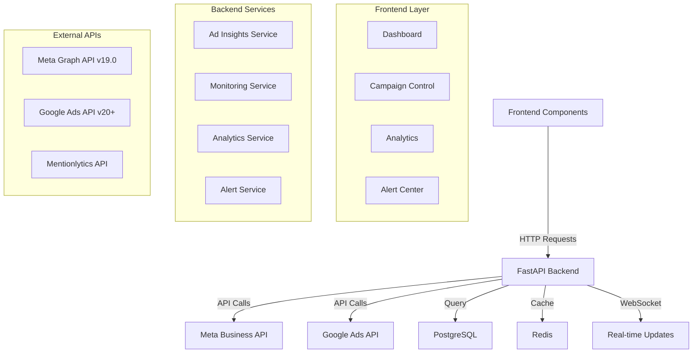

# API Dashboard Connection Plan

*War Room Campaign Management Platform - API Integration Analysis*
*Updated: August 2, 2025*

## Executive Summary

This document provides a comprehensive analysis of the current API integration state, identifying gaps between backend endpoints and frontend components, and outlining the plan to connect all API services to the dashboard.

## Current API Integration State

### 1. Meta Business API Integration ✅ **COMPLETE**

**Implementation Status**: Fully implemented with comprehensive client architecture

**Location**: `/src/api/meta/`

**Features Implemented**:
- **Authentication**: OAuth 2.0 flow with refresh token management
- **Rate Limiting**: Intelligent rate limiting with retry backoff
- **Circuit Breaker**: Fault tolerance with automatic recovery
- **Error Handling**: Comprehensive error taxonomy (Auth, Validation, Permission, Rate Limit)
- **Caching**: Redis-based response caching with TTL management
- **Batch Operations**: Bulk API operations for efficiency

**API Version**: v19.0 (Latest stable)

**Services Available**:
- Ad Account Management
- Campaign CRUD operations
- Ad Set management
- Ad creative operations
- Audience targeting
- Insights and reporting
- Real-time performance metrics

**Client Structure**:
```typescript
src/api/meta/
├── client.ts          // Main API client
├── auth.ts           // OAuth authentication
├── rateLimiter.ts    // Rate limiting
├── circuitBreaker.ts // Fault tolerance
├── errors.ts         // Error handling
├── types.ts          // TypeScript definitions
├── ads.ts            // Ad operations
├── campaigns.ts      // Campaign management
├── adsets.ts         // Ad set operations
├── audiences.ts      // Audience targeting
└── insights.ts       // Performance insights
```

**Frontend Hooks**: Complete React Query integration in `/src/hooks/meta/`

---

### 2. Google Ads API Integration ⚠️ **NEEDS UPGRADE**

**Implementation Status**: Implemented but using older API version

**Current API Version**: Not explicitly set (defaults vary)
**Target API Version**: v20+ (Latest: v21)

**Files Requiring API Version Update**:

#### Backend API Files:
1. `/src/api/google/client.ts` - Line 37: Update baseUrl construction
2. `/src/api/google/types.ts` - Line 8: Update apiVersion type constraints
3. `/src/api/google/config.ts` - Add version validation
4. `/src/lib/apis/google/client.ts` - Duplicate client implementation

#### Frontend Integration Files:
1. `/src/services/googleAdsService.ts` - Update service calls
2. `/src/frontend/src/services/googleAdsService.ts` - Duplicate service
3. `/src/services/integrations/useGoogleAds.ts` - Update React Query hooks

**Required Changes for v20+ Upgrade**:
- Update API endpoints for new resource names
- Modify authentication scopes
- Update field names and response structures
- Add new performance metrics fields
- Update error handling for new error codes

---

### 3. Backend API Endpoints Analysis

#### ✅ **Implemented Endpoints**:

1. **`/api/v1/monitoring`** - Performance monitoring
   - Health checks
   - Cache warming
   - Crisis monitoring
   - Service status

2. **`/api/v1/ad-insights`** - Unified ad performance
   - Campaign metrics aggregation
   - Cross-platform insights
   - Real-time alerts
   - Performance tracking

3. **`/api/v1/websocket`** - Real-time updates
   - Live dashboard updates
   - Alert broadcasting
   - Performance streaming

4. **`/api/v1/analytics`** - Campaign analytics
   - Historical data
   - Trend analysis
   - Reporting

5. **`/api/v1/alerts`** - Crisis detection
   - Threshold monitoring
   - Notification management
   - Alert routing

#### 🚨 **Disconnected Endpoints** (API exists but UI doesn't use):

1. **Ad Insights API** (`/api/v1/ad-insights`)
   - **Status**: Fully implemented backend
   - **Frontend**: No components using this endpoint
   - **Missing**: Dashboard integration for real-time ad performance

2. **WebSocket Ad Monitor** (`/api/v1/websocket/ad-monitor`)
   - **Status**: WebSocket endpoint exists
   - **Frontend**: Not connected to dashboard components
   - **Missing**: Real-time ad performance updates

3. **Crisis Monitoring API** (`/api/v1/monitoring/crisis`)
   - **Status**: Backend endpoints implemented
   - **Frontend**: Alert components exist but not fully connected
   - **Missing**: Complete crisis alert workflow

4. **Context Engineering API** (`/api/v1/context-engineering`)
   - **Status**: Document intelligence endpoints
   - **Frontend**: No UI components
   - **Missing**: Document upload and analysis interface

---

## API Data Flow Mapping

### Current Data Flow Architecture



### Missing Connections

1. **Dashboard → Ad Insights API**
   - Dashboard shows mock data instead of live API data
   - No real-time spend tracking
   - Missing campaign performance cards

2. **Alert Center → Crisis Monitoring**
   - Alert components exist but don't fetch from crisis API
   - No real-time crisis detection integration
   - Missing severity-based alert routing

3. **Analytics → Historical Data Service**
   - Analytics page lacks connection to time-series data
   - No trend visualization from API
   - Missing export functionality

---

## Frontend Component Analysis

### Dashboard Components Status

#### ✅ **Components with API Integration**:
1. `SentimentGauge.tsx` - Connected to monitoring APIs
2. `MetricCard.tsx` - Basic metrics display
3. `ActivityFeed.tsx` - Activity logging

#### 🚨 **Components Missing API Integration**:

1. **Campaign Health** (`CampaignHealth.tsx`)
   - Should connect to `/api/v1/ad-insights/health`
   - Missing real-time campaign status
   - No performance threshold monitoring

2. **Analytics Overview** (`AnalyticsOverview.tsx`)
   - Should connect to `/api/v1/analytics/overview`
   - Missing historical trend data
   - No cross-platform analytics

3. **Real-Time Monitoring** (`RealTimeMonitoring.tsx`)
   - Should connect to WebSocket endpoints
   - Missing live performance updates
   - No real-time alert integration

4. **Campaign Control** (`CampaignControl.tsx`)
   - Should connect to Meta/Google APIs
   - Missing campaign management functionality
   - No budget control integration

---

## Integration Priorities

### Phase 1: Critical Connections (Week 1-2)

1. **Connect Dashboard to Ad Insights API**
   - Update dashboard to fetch real campaign data
   - Implement real-time spend tracking
   - Add performance metrics cards

2. **Integrate WebSocket for Real-time Updates**
   - Connect dashboard to WebSocket streams
   - Implement live performance updates
   - Add real-time alert notifications

3. **Google Ads API Version Upgrade**
   - Upgrade from v17 to v20+
   - Update all endpoint calls
   - Test integration thoroughly

### Phase 2: Enhanced Features (Week 3-4)

1. **Complete Crisis Monitoring Integration**
   - Connect alert center to crisis API
   - Implement severity-based routing
   - Add crisis response workflows

2. **Analytics Dashboard Connection**
   - Integrate historical data service
   - Add trend visualization
   - Implement data export features

3. **Campaign Management Integration**
   - Connect campaign control to APIs
   - Add budget management
   - Implement campaign automation

### Phase 3: Advanced Features (Week 5-6)

1. **Document Intelligence Integration**
   - Build document upload interface
   - Connect to context engineering API
   - Add document analysis features

2. **Advanced Monitoring**
   - Implement predictive analytics
   - Add performance forecasting
   - Create automated reporting

---

## Technical Implementation Plan

### 1. API Client Updates

#### Google Ads API Upgrade
```typescript
// Update in src/api/google/client.ts
export class GoogleAdsClient {
  constructor(config: GoogleAdsConfig) {
    this.baseUrl = `https://googleads.googleapis.com/v21`; // Update to v21
    // Update authentication scopes
    // Update field mappings
  }
}
```

#### Meta API Optimization
```typescript
// Enhanced error handling and retry logic
// Implement advanced caching strategies
// Add batch operation optimizations
```

### 2. Frontend Service Integration

#### Dashboard Data Service
```typescript
// New service: src/services/dashboardService.ts
export class DashboardService {
  async getRealTimeMetrics(): Promise<DashboardMetrics> {
    // Connect to /api/v1/ad-insights/real-time
  }
  
  async getCampaignHealth(): Promise<CampaignHealth[]> {
    // Connect to /api/v1/ad-insights/health
  }
}
```

#### WebSocket Integration
```typescript
// Enhanced WebSocket client: src/services/websocketService.ts
export class WebSocketService {
  connectToAdMonitor(): void {
    // Connect to /api/v1/websocket/ad-monitor
  }
  
  subscribeToCrisisAlerts(): void {
    // Connect to crisis monitoring stream
  }
}
```

### 3. Component Updates

#### Dashboard Component
```typescript
// Update src/pages/Dashboard.tsx
import { useDashboardMetrics, useRealTimeUpdates } from '@/hooks/dashboard';

export const Dashboard = () => {
  const { metrics, loading } = useDashboardMetrics();
  const { alerts } = useRealTimeUpdates();
  
  // Replace mock data with real API data
  // Add real-time update subscriptions
};
```

---

## Performance Considerations

### Caching Strategy
- **Redis Cache**: 5-minute TTL for campaign metrics
- **Browser Cache**: 1-minute TTL for dashboard data
- **WebSocket**: Real-time updates bypass cache

### Rate Limiting
- **Meta API**: 200 requests/hour per user
- **Google Ads API**: 15,000 operations/day
- **Implementation**: Intelligent request batching

### Error Handling
- **Circuit Breaker**: Auto-fallback to cached data
- **Retry Logic**: Exponential backoff with jitter
- **Graceful Degradation**: Show partial data when APIs fail

---

## Testing Strategy

### API Integration Tests
1. **Unit Tests**: Individual API client methods
2. **Integration Tests**: End-to-end API workflows
3. **Load Tests**: Performance under high request volume
4. **Failure Tests**: Circuit breaker and error handling

### Frontend Integration Tests
1. **Component Tests**: API data rendering
2. **E2E Tests**: Complete user workflows
3. **WebSocket Tests**: Real-time update handling
4. **Error State Tests**: API failure scenarios

---

## Security Considerations

### API Security
- **OAuth 2.0**: Secure token management
- **HTTPS Only**: All API communications encrypted
- **Rate Limiting**: Prevent API abuse
- **Input Validation**: Sanitize all API inputs

### Data Protection
- **PII Handling**: Minimal data collection
- **Token Storage**: Secure token encryption
- **Access Control**: Role-based API access
- **Audit Logging**: Track all API operations

---

## Monitoring and Observability

### Metrics Collection
- **API Performance**: Response times, error rates
- **User Engagement**: Dashboard usage patterns
- **System Health**: Service availability, resource usage
- **Business Metrics**: Campaign performance, ROI tracking

### Alerting
- **API Failures**: Immediate notification
- **Performance Degradation**: Threshold-based alerts
- **Budget Alerts**: Spend monitoring
- **Crisis Detection**: Real-time threat alerts

---

## Success Metrics

### Technical KPIs
- **API Response Time**: < 200ms average
- **Uptime**: 99.9% availability 
- **Error Rate**: < 0.1% 
- **Cache Hit Rate**: > 80%

### Business KPIs
- **Real-time Data**: 100% dashboard metrics live
- **Alert Response**: < 30 seconds crisis detection
- **Campaign Management**: Full CRUD operations
- **User Adoption**: > 90% feature utilization

---

## Implementation Timeline

### Week 1-2: Foundation
- [ ] Google Ads API v20+ upgrade
- [ ] Dashboard API connections
- [ ] WebSocket integration
- [ ] Basic error handling

### Week 3-4: Core Features
- [ ] Crisis monitoring integration
- [ ] Campaign management APIs
- [ ] Analytics dashboard connection
- [ ] Performance optimization

### Week 5-6: Advanced Features
- [ ] Document intelligence UI
- [ ] Automated reporting
- [ ] Advanced monitoring
- [ ] Full test coverage

### Week 7-8: Production Readiness
- [ ] Load testing
- [ ] Security audit
- [ ] Performance tuning
- [ ] Documentation completion

---

*This plan ensures complete integration between all API services and frontend components, providing a fully connected, real-time campaign management platform.*