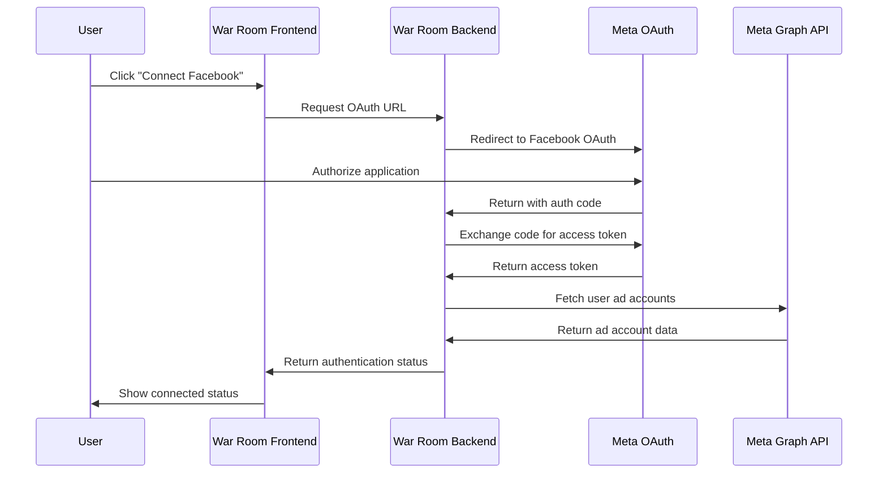

# Meta Business API Application Requirements

## Application Overview

**Application Name**: War Room Analytics  
**Application Type**: Campaign Management Platform  
**Developer**: Think Big Media  
**Contact**: admin@warroom.app  
**Website**: https://war-room-oa9t.onrender.com  
**Version**: 1.0.0  

### Business Purpose

War Room is a comprehensive campaign management platform designed for political campaigns, advocacy groups, and non-profit organizations. The application integrates with Meta Business API to provide unified advertising analytics and campaign optimization tools.

## 1. User Authentication Flow

### 1.1 OAuth2 Implementation

Our application implements Facebook Login using OAuth2 with the following flow:



### 1.2 Authentication Endpoints

#### Primary OAuth Flow
- **Authorization URL**: `https://www.facebook.com/v18.0/dialog/oauth`
- **Token Exchange**: `https://graph.facebook.com/v18.0/oauth/access_token`
- **Redirect URI**: `https://war-room-oa9t.onrender.com/auth/callback`

#### Internal API Endpoints
- `POST /api/v1/meta/auth/callback` - Handle OAuth callback
- `GET /api/v1/meta/auth/status` - Check authentication status
- `POST /api/v1/meta/auth/refresh` - Refresh access token
- `DELETE /api/v1/meta/auth/disconnect` - Revoke access

### 1.3 User Data Scope

The application requests the following permissions:
- `ads_read` - Read advertising insights and campaign data
- `ads_management` - Manage advertising campaigns (future feature)
- `business_management` - Access to Business Manager accounts
- `pages_read_engagement` - Read page engagement metrics

## 2. Data Access Permissions Requested

### 2.1 Core Permissions

| Permission | Purpose | Data Accessed | Retention Period |
|------------|---------|---------------|------------------|
| `ads_read` | Campaign Analytics | Ad performance metrics, audience insights | 90 days |
| `business_management` | Account Access | Business account information, user roles | 30 days |
| `pages_read_engagement` | Page Analytics | Page engagement metrics, post performance | 90 days |

### 2.2 Specific Data Fields

#### Ad Account Data
```json
{
  "fields": [
    "id", "name", "account_id", "account_status", 
    "currency", "timezone_name", "amount_spent", "balance"
  ],
  "purpose": "Display account selection and basic information"
}
```

#### Campaign Insights
```json
{
  "fields": [
    "campaign_name", "impressions", "clicks", "spend",
    "reach", "frequency", "cpm", "cpc", "ctr"
  ],
  "purpose": "Generate performance reports and analytics dashboards"
}
```

#### Audience Insights
```json
{
  "fields": [
    "age", "gender", "country", "region", "impressions", "clicks"
  ],
  "purpose": "Demographic analysis and audience optimization recommendations"
}
```

### 2.3 Data Usage Justification

#### Campaign Performance Analysis
- **Data Used**: Impressions, clicks, spend, conversions
- **Business Purpose**: Generate comprehensive performance reports
- **User Benefit**: Optimize ad spend and improve campaign ROI

#### Audience Demographics
- **Data Used**: Age, gender, location breakdowns
- **Business Purpose**: Provide demographic insights
- **User Benefit**: Better audience targeting and segmentation

#### Cross-Platform Analytics
- **Data Used**: Meta campaign data + Google Ads data + internal metrics
- **Business Purpose**: Unified reporting across advertising platforms
- **User Benefit**: Centralized campaign management and holistic performance view

## 3. Data Storage and Security Measures

### 3.1 Data Storage Architecture

#### Temporary Token Storage (Redis)
- **Purpose**: OAuth access tokens and refresh tokens
- **Retention**: 60 days (Meta's token expiry)
- **Encryption**: AES-256 encryption at rest
- **Location**: Secure Redis cluster

#### Analytics Data (PostgreSQL)
- **Purpose**: Aggregated performance metrics
- **Retention**: 1 year for trends analysis
- **Encryption**: Database-level encryption (AES-256)
- **Location**: PostgreSQL on secure cloud infrastructure

#### User Preferences (Database)
- **Purpose**: Dashboard configurations, alert settings
- **Retention**: Until user account deletion
- **Encryption**: Field-level encryption for sensitive data

### 3.2 Security Measures

#### Network Security
- **HTTPS/TLS 1.3**: All API communications encrypted
- **Certificate Pinning**: Prevents man-in-the-middle attacks
- **CORS Policy**: Restricted to authorized domains only
- **Rate Limiting**: 100 requests/minute per user

#### Authentication Security
- **JWT Tokens**: Signed with RS256 algorithm
- **Token Rotation**: Access tokens refreshed every 60 minutes
- **Session Management**: Secure session handling with httpOnly cookies
- **Multi-factor Authentication**: Available for admin users

#### Data Protection
- **Encryption at Rest**: AES-256 encryption for all stored data
- **Encryption in Transit**: TLS 1.3 for all network communications
- **Key Management**: AWS KMS for encryption key management
- **Access Logging**: All data access logged and monitored

#### Infrastructure Security
- **Cloud Provider**: Render.com with SOC2 compliance
- **Network Isolation**: VPC with private subnets
- **Firewall**: Web Application Firewall (WAF) protection
- **Monitoring**: 24/7 security monitoring and alerting

### 3.3 Data Minimization

#### Collection Principles
- Only collect data necessary for stated functionality
- No collection of personal messages or private content
- Aggregated metrics only, no individual user tracking
- Regular data purging based on retention policies

#### Processing Limitations
- Data used only for analytics and reporting purposes
- No selling or sharing of user data with third parties
- No profiling for advertising purposes outside stated scope
- Automated processing limited to performance calculations

## 4. User Data Deletion Capabilities

### 4.1 User-Initiated Deletion

#### Account Disconnection
- **Endpoint**: `DELETE /api/v1/meta/auth/disconnect`
- **Action**: Immediately revokes Meta access tokens
- **Scope**: Removes all Meta-related authentication data
- **Timeline**: Immediate (< 1 minute)

#### Data Export Before Deletion
- **Endpoint**: `GET /api/v1/analytics/export`
- **Format**: JSON, CSV, PDF formats available
- **Content**: Historical analytics data, dashboard configurations
- **Availability**: 30 days retention before deletion

#### Complete Account Deletion
- **Endpoint**: `DELETE /api/v1/user/account`
- **Scope**: All user data including analytics history
- **Process**: 
  1. Immediate account deactivation
  2. 30-day grace period for data recovery
  3. Complete data purge after grace period
- **Timeline**: 30 days maximum

### 4.2 Automated Data Purging

#### Token Expiry
- **Meta Access Tokens**: Automatically expire per Meta's policy (60 days)
- **Refresh Tokens**: Purged when expired or user disconnects
- **Session Data**: Cleared after 24 hours of inactivity

#### Analytics Data Retention
- **Raw Metrics**: 90 days retention
- **Aggregated Reports**: 1 year retention
- **User Configurations**: Retained until account deletion

#### Audit Trail
- **Access Logs**: 1 year retention for security purposes
- **Deletion Logs**: Permanent record of data deletion requests
- **Compliance Reporting**: Available for regulatory requirements

### 4.3 Regulatory Compliance

#### GDPR Compliance
- **Right to Access**: Users can download all their data
- **Right to Rectification**: Users can update their information
- **Right to Erasure**: Complete data deletion available
- **Right to Portability**: Data export in machine-readable formats

#### CCPA Compliance
- **Data Disclosure**: Clear information about data collection
- **Opt-Out Rights**: Users can opt out of data processing
- **Non-Discrimination**: No penalty for exercising privacy rights

## 5. Privacy Policy Compliance

### 5.1 Data Collection Transparency

#### Clear Disclosure
Our privacy policy clearly states:
- What data is collected from Meta Business API
- Why the data is needed for application functionality
- How long data is retained
- Who has access to the data
- User rights regarding their data

#### Consent Management
- **Explicit Consent**: Users must actively authorize Meta connection
- **Granular Permissions**: Users can see exactly what permissions are requested
- **Revocable Consent**: Users can disconnect Meta integration at any time
- **Re-consent**: Users are notified of any permission changes

### 5.2 Data Processing Purposes

#### Legitimate Business Purposes
1. **Campaign Analytics**: Generate performance reports and insights
2. **Platform Integration**: Combine Meta data with other advertising platforms
3. **Optimization Recommendations**: AI-powered campaign improvement suggestions
4. **Historical Reporting**: Track performance trends over time

#### Prohibited Uses
- No selling of user data to third parties
- No use of data for purposes outside stated functionality
- No individual user tracking or profiling
- No unauthorized sharing with external parties

### 5.3 Third-Party Data Sharing

#### Authorized Sharing
- **Cloud Infrastructure**: Render.com (hosting), AWS (storage) - under data processing agreements
- **Analytics Services**: PostHog (aggregated usage analytics) - anonymized data only
- **Security Services**: Sentry (error monitoring) - no personal data shared

#### Data Processing Agreements
All third-party services have signed Data Processing Agreements (DPAs) that ensure:
- Data is processed only for specified purposes
- Appropriate security measures are in place
- Data is not used for their own purposes
- Data subject rights are respected

## 6. Technical Implementation Details

### 6.1 OAuth2 Flow Implementation

#### Authorization Request
```javascript
const authUrl = `https://www.facebook.com/v18.0/dialog/oauth?` +
  `client_id=${META_APP_ID}&` +
  `redirect_uri=${encodeURIComponent(REDIRECT_URI)}&` +
  `scope=${encodeURIComponent('ads_read,business_management')}&` +
  `response_type=code&` +
  `state=${generateSecureState()}`;
```

#### Token Exchange
```python
async def exchange_code_for_token(code: str, redirect_uri: str):
    params = {
        'client_id': META_APP_ID,
        'client_secret': META_APP_SECRET,
        'redirect_uri': redirect_uri,
        'code': code
    }
    
    response = await httpx.get(
        'https://graph.facebook.com/v18.0/oauth/access_token',
        params=params
    )
    
    return response.json()
```

### 6.2 API Integration Architecture

#### Service Layer Design
```python
class MetaBusinessService:
    def __init__(self):
        self.base_url = "https://graph.facebook.com/v18.0"
        self.rate_limiter = RateLimiter(calls=100, period=3600)
    
    async def get_campaign_insights(self, account_id: str, date_range: dict):
        # Implements rate limiting, error handling, and data normalization
        pass
    
    async def get_audience_insights(self, account_id: str, filters: dict):
        # Secure data retrieval with proper error handling
        pass
```

#### Error Handling and Retry Logic
```python
@retry(
    stop=stop_after_attempt(3),
    wait=wait_exponential(multiplier=1, min=4, max=10),
    retry=retry_if_exception_type(httpx.HTTPStatusError)
)
async def make_api_request(url: str, params: dict):
    async with httpx.AsyncClient() as client:
        response = await client.get(url, params=params)
        response.raise_for_status()
        return response.json()
```

### 6.3 Security Implementation

#### Token Security
```python
class TokenManager:
    def __init__(self):
        self.encryption_key = os.getenv('ENCRYPTION_KEY')
        self.redis_client = redis.Redis()
    
    async def store_token(self, user_id: str, token_data: dict):
        encrypted_data = self.encrypt(json.dumps(token_data))
        await self.redis_client.setex(
            f"meta_token:{user_id}",
            token_data.get('expires_in', 3600),
            encrypted_data
        )
    
    def encrypt(self, data: str) -> bytes:
        # AES-256 encryption implementation
        pass
```

#### Request Validation
```python
from pydantic import BaseModel, Field

class CampaignInsightsRequest(BaseModel):
    account_id: str = Field(..., regex=r'^act_\d+$')
    date_range: dict = Field(..., min_items=2, max_items=2)
    metrics: list = Field(..., min_items=1, max_items=10)
    
    @validator('date_range')
    def validate_date_range(cls, v):
        # Ensure date range is reasonable (max 2 years)
        pass
```

## 7. Demo Scenarios for Screen Recording

### 7.1 User Onboarding Flow

#### Scenario 1: Initial Connection
1. **User Registration**: New user signs up for War Room
2. **Dashboard Access**: User sees empty analytics dashboard
3. **Meta Connection**: User clicks "Connect Facebook Ads"
4. **OAuth Flow**: User is redirected to Facebook for authorization
5. **Permissions Review**: User reviews requested permissions
6. **Authorization**: User grants access to Meta Business API
7. **Account Selection**: User selects which ad account to connect
8. **Success Confirmation**: User sees confirmation of successful connection
9. **Data Loading**: Initial campaign data loads in dashboard

#### Scenario 2: Account Management
1. **Auth Status Check**: Dashboard shows connected Meta account
2. **Account Switching**: User switches between different ad accounts
3. **Permission Review**: User reviews current permissions
4. **Token Refresh**: System automatically refreshes expired tokens
5. **Disconnection**: User can disconnect Meta integration

### 7.2 Data Access and Analytics

#### Scenario 3: Campaign Analytics
1. **Dashboard Overview**: User sees high-level campaign metrics
2. **Detailed Reports**: User drills down into specific campaign performance
3. **Date Range Selection**: User adjusts reporting timeframe
4. **Cross-Platform View**: User compares Meta ads with Google Ads
5. **Export Functionality**: User exports report to PDF/CSV

#### Scenario 4: Audience Insights
1. **Audience Demographics**: User views age/gender breakdowns
2. **Geographic Analysis**: User examines location-based performance
3. **Audience Optimization**: System provides targeting recommendations
4. **Comparative Analysis**: User compares different audience segments

### 7.3 Privacy and Data Management

#### Scenario 5: Data Control
1. **Privacy Settings**: User accesses data management settings
2. **Data Export**: User downloads all their Meta advertising data
3. **Permission Management**: User reviews and modifies granted permissions
4. **Data Deletion**: User initiates data deletion process
5. **Disconnection**: User completely disconnects Meta integration

#### Scenario 6: Security Features
1. **Security Dashboard**: User reviews security settings
2. **Access Logs**: User views history of data access
3. **Two-Factor Auth**: User enables additional security measures
4. **Session Management**: User manages active sessions

## 8. Meta Requirements Checklist

### 8.1 Business Verification Requirements

#### Company Documentation
- [ ] Business Registration Certificate
- [ ] Tax ID/EIN Documentation
- [ ] Business Address Verification
- [ ] Domain Ownership Verification (war-room.app)
- [ ] Business Bank Account Verification

#### App Verification Materials
- [ ] Detailed App Description and Use Cases
- [ ] Screenshots of App Interface
- [ ] Video Demo of OAuth Flow
- [ ] Privacy Policy Link and Content Review
- [ ] Terms of Service Documentation

### 8.2 Technical Requirements

#### API Implementation Standards
- [ ] OAuth2 Implementation Following Meta Guidelines
- [ ] Proper Error Handling and User Feedback
- [ ] Rate Limiting Compliance (100 calls/hour default)
- [ ] Webhook Endpoint for Deauthorization Events
- [ ] Secure Token Storage and Management

#### Data Handling Compliance
- [ ] Data Retention Policy Documentation
- [ ] User Data Deletion Mechanisms
- [ ] Privacy Controls and User Consent
- [ ] Cross-Border Data Transfer Compliance
- [ ] Security Audit and Penetration Testing Results

### 8.3 Compliance and Legal

#### Privacy Compliance
- [ ] GDPR Compliance Documentation
- [ ] CCPA Compliance (if applicable)
- [ ] Privacy by Design Implementation
- [ ] Data Processing Impact Assessment
- [ ] User Consent Management System

#### Security Requirements
- [ ] Security Assessment Questionnaire Responses
- [ ] Penetration Testing Reports
- [ ] SOC2 Compliance Documentation
- [ ] Incident Response Plan
- [ ] Business Continuity Plan

### 8.4 App Review Preparation

#### Review Materials
- [ ] App Functionality Video (5-10 minutes)
- [ ] Step-by-Step OAuth Flow Documentation
- [ ] User Journey Maps and Workflows
- [ ] API Usage Examples and Code Samples
- [ ] Error Handling Demonstrations

#### Business Use Case
- [ ] Clear Business Value Proposition
- [ ] Target Audience Definition
- [ ] Competitive Analysis
- [ ] Revenue Model Documentation
- [ ] User Testimonials or Case Studies

## 9. App Functionality Description

### 9.1 Core Features

#### Unified Campaign Management
War Room serves as a centralized platform for political campaigns and advocacy organizations to manage their digital advertising efforts across multiple platforms, with Meta Business API integration providing:

- **Cross-Platform Analytics**: Combine Meta advertising data with Google Ads, internal metrics, and other marketing channels
- **Real-Time Performance Monitoring**: Live dashboards showing campaign performance, spend, and engagement metrics
- **Automated Reporting**: Scheduled reports delivered via email with key performance indicators
- **Budget Optimization**: AI-powered recommendations for budget allocation across platforms

#### Advanced Analytics and Insights
- **Audience Demographics**: Deep dive into age, gender, location, and interest-based audience segments
- **Performance Trends**: Historical analysis with predictive modeling for future performance
- **Comparative Analysis**: Side-by-side comparison of different campaigns, ad sets, and creative performance
- **ROI Tracking**: Revenue attribution and return on ad spend calculations

#### Campaign Optimization Tools
- **A/B Testing Framework**: Built-in tools for testing different audiences, creatives, and messaging
- **Bid Management**: Automated and manual bid optimization based on performance goals
- **Audience Expansion**: Lookalike audience creation and management
- **Creative Performance**: Analysis of ad creative effectiveness across different segments

### 9.2 Meta Integration Specific Features

#### Account Management
- **Multi-Account Support**: Connect and manage multiple Meta Business accounts
- **Team Collaboration**: Shared access to campaign data with role-based permissions
- **Account Health Monitoring**: Alerts for account issues, policy violations, or spending anomalies

#### Data Visualization
- **Interactive Dashboards**: Customizable dashboards with drag-and-drop widgets
- **Geospatial Analytics**: Map-based visualization of campaign performance by location
- **Time-Series Analysis**: Trend analysis with customizable date ranges and filters

### 9.3 Target User Base

#### Primary Users
- **Political Campaigns**: Federal, state, and local political campaigns
- **Advocacy Organizations**: Non-profit advocacy groups and PACs
- **Campaign Consultants**: Professional campaign management firms
- **Non-Profit Organizations**: Charitable organizations running awareness campaigns

#### Use Cases
- **Election Campaigns**: Candidate promotion and voter outreach
- **Issue Advocacy**: Public policy campaigns and awareness initiatives
- **Fundraising**: Donor acquisition and retention campaigns
- **Grassroots Mobilization**: Community organizing and engagement

## 10. Security Assessment Responses

### 10.1 Data Security Measures

#### Question: How do you secure user data?
**Response**: War Room implements enterprise-grade security measures including:
- **Encryption**: AES-256 encryption for data at rest, TLS 1.3 for data in transit
- **Access Controls**: Role-based access control with multi-factor authentication
- **Network Security**: Web Application Firewall, DDoS protection, and VPC isolation
- **Monitoring**: 24/7 security monitoring with automated threat detection
- **Compliance**: SOC2 Type II compliance with regular security audits

#### Question: How do you handle authentication tokens?
**Response**: OAuth tokens are managed with the highest security standards:
- **Storage**: Encrypted storage in Redis with automatic expiration
- **Transmission**: All token exchanges use HTTPS with certificate pinning
- **Rotation**: Automatic token refresh before expiration
- **Revocation**: Immediate token revocation upon user request
- **Monitoring**: All token usage logged and monitored for anomalies

### 10.2 Privacy Protection

#### Question: How do you protect user privacy?
**Response**: Privacy is built into every aspect of our platform:
- **Data Minimization**: Collect only data necessary for stated functionality
- **Purpose Limitation**: Use data only for explicitly stated purposes
- **Consent Management**: Clear, granular consent with easy withdrawal
- **User Control**: Users can export, modify, or delete their data at any time
- **Transparency**: Clear privacy policy explaining all data practices

#### Question: Do you share data with third parties?
**Response**: War Room has strict data sharing limitations:
- **No Data Sales**: We never sell user data to third parties
- **Service Providers**: Only essential service providers under strict DPAs
- **Anonymization**: Any analytics shared is aggregated and anonymized
- **User Consent**: No sharing without explicit user consent
- **Legal Requirements**: Only when required by law with user notification

### 10.3 Incident Response

#### Question: How do you handle security incidents?
**Response**: We have a comprehensive incident response plan:
- **Detection**: Automated monitoring and alerting systems
- **Response Team**: Dedicated security team available 24/7
- **Containment**: Immediate isolation and containment procedures
- **Investigation**: Forensic analysis and root cause determination
- **Communication**: Transparent communication with affected users
- **Remediation**: Complete resolution and security improvements

### 10.4 Business Continuity

#### Question: How do you ensure service availability?
**Response**: War Room maintains high availability through:
- **Redundancy**: Multi-region deployment with automatic failover
- **Backup Systems**: Regular automated backups with point-in-time recovery
- **Load Balancing**: Distributed load balancing across multiple servers
- **Monitoring**: Real-time performance monitoring and alerting
- **SLA Commitment**: 99.9% uptime service level agreement

## 11. Supporting Documentation

### 11.1 Required Attachments

1. **Privacy Policy** (war-room.app/privacy)
2. **Terms of Service** (war-room.app/terms)
3. **Data Processing Agreement Template**
4. **Security Assessment Report**
5. **Business Registration Certificate**
6. **App Screenshots and Demo Videos**

### 11.2 Contact Information

**Primary Contact**: Roderick Andrews  
**Email**: roderick@wethinkbig.io  
**Phone**: +1 (813) 965-2725  
**Address**: Tampa, FL, USA  

**Technical Contact**: Development Team  
**Email**: dev@wethinkbig.io  
**Support**: support@warroom.app  

### 11.3 Compliance Certifications

- **SOC2 Type II**: Pending (completion expected Q2 2024)
- **GDPR Compliance**: Implemented and documented
- **CCPA Compliance**: Implemented for California users
- **COPPA Compliance**: N/A (no users under 13)

---

**Document Version**: 1.0  
**Last Updated**: August 7, 2024  
**Review Date**: Quarterly  
**Next Review**: November 7, 2024